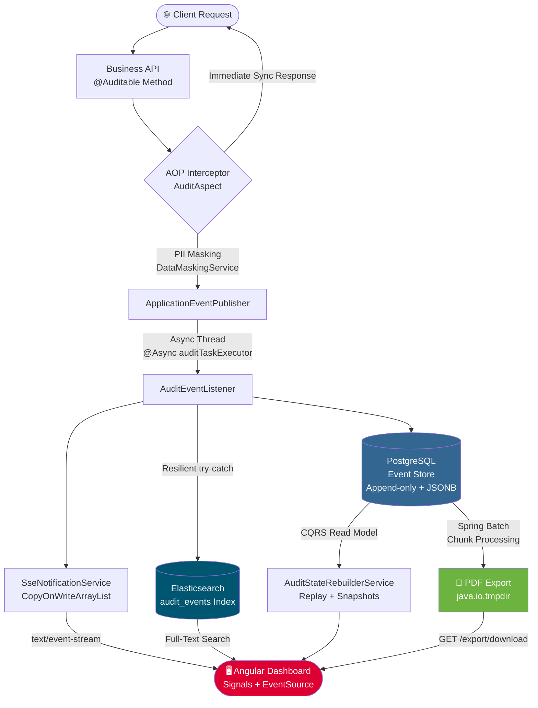

<div align="center">

# 🛡️ AuditVault

**An Enterprise-Grade, Event-Sourced Audit Log System**

[](https://openjdk.org/projects/jdk/17/)
[](https://spring.io/projects/spring-boot)
[](https://angular.io/)
[](https://www.postgresql.org/)
[](https://www.elastic.co/)
[](./LICENSE)

</div>

---

## 🔍 Overview

*"What happened to record X?"* — A critical question every enterprise eventually faces.

In traditional CRUD-based systems, data mutations overwrite history irreversibly. When billing discrepancies, security breaches, or regulatory audits (LGPD, GDPR, SOX) occur, piecing together the timeline is often impossible. 

**AuditVault** addresses this challenge elegantly. By annotating service methods with `@Auditable`, mutation events are transparently intercepted using Aspect-Oriented Programming (AOP), stripped of sensitive PII data, and immutably recorded into an append-only Event Store. 

### Key Architectural Benefits:
- **CQRS Pattern:** Decouples write and read models, allowing point-in-time state reconstruction.
- **Real-Time Streaming:** Pushes live audit events to the dashboard via Server-Sent Events (SSE).
- **Blazing Fast Search:** Leverages Elasticsearch for sub-second full-text queries across millions of logs.

---

## 🏗️ Architecture & Data Flow

AuditVault relies on an asynchronous, resilient pipeline to ensure zero performance impact on core business logic.



---

## ⚙️ Core Features & Engineering Highlights

- **🔒 Automated PII Data Masking:** Ensures LGPD/GDPR compliance. The `DataMaskingService` scans JSON payloads for sensitive keys (e.g., `password`, `cpf`, `cardNumber`, `secret`) and redacts them (`***`) prior to storage.
- **📸 $O(1)$ State Reconstruction via Snapshots:** Replaying 100,000 events to determine current state is highly inefficient. The `SnapshotTriggerService` captures state checkpoints every *N* events, drastically speeding up CQRS queries.
- **📄 Async PDF Export (Spring Batch):** Generating massive compliance reports shouldn't block HTTP threads. The chunk-oriented batch processor runs asynchronously, issuing a `jobExecutionId` for polling and download.
- **🔍 High-Performance Full-Text Search:** Standard `LIKE %term%` database queries fall short at scale. Events are indexed in Elasticsearch asynchronously, ensuring rapid multi-dimensional search.
- **⚡ Live Dashboard via SSE:** Unidirectional Server-Sent Events push logs instantly to the UI. A 25-second heartbeat mechanism maintains persistent, low-overhead connections through enterprise proxies.
- **📊 SRE-Ready Observability:** Pre-configured endpoints for JVM health, connection pools, and query latencies exported in Prometheus format via Spring Boot Actuator.

---

## 🛠️ Tech Stack

| Layer | Technologies |
| :--- | :--- |
| **Backend Core** | Java 17, Spring Boot 3.2, Spring AOP, Spring Data JPA |
| **Batch & Search** | Spring Batch (Chunk-oriented), Spring Data Elasticsearch |
| **Write Database** | PostgreSQL 15 (JSONB optimization, Flyway Migrations) |
| **Search Engine** | Elasticsearch 8.x |
| **Frontend** | Angular 17+ (Standalone, Signals, TailwindCSS) |
| **Reporting** | OpenPDF / Apache PDFBox |
| **Observability** | Micrometer + Prometheus / Actuator |
| **Infrastructure** | Docker Multi-stage, Docker Compose, Nginx Reverse Proxy |

---

## 🚀 How to Run

### Prerequisites
- [Docker Desktop](https://www.docker.com/products/docker-desktop/) installed and running.

### Quick Start
1. Clone the repository:
   ```bash
   git clone https://github.com/joaogabriel43/AuditVault.git
   cd AuditVault
   ```
2. Spin up the entire ecosystem:
   ```bash
   docker-compose up -d --build
   ```

*Docker Compose will automatically orchestrate the build sequence, ensuring standard health checks pass before booting dependent services:*
- `auditvault-postgres` (Event Store)
- `auditvault-elasticsearch` (Search Index)
- `auditvault-backend` (Spring Boot API)
- `auditvault-frontend` (Angular SPA via Nginx)

### 🗺️ Accessible Services

| Service | Address | Purpose |
| :--- | :--- | :--- |
| **Frontend UI** | [http://localhost:4200](http://localhost:4200) | Live monitoring & querying |
| **API Gateway** | `http://localhost:8080/api/audit` | System endpoints |
| **Health Check** | `http://localhost:8080/actuator/health` | Node metrics |
| **Prometheus** | `http://localhost:8080/actuator/prometheus` | SRE scraping |

---

## 📡 Primary API Endpoints

```http
# Retrieve paginated event history
GET /api/audit/events/{aggregateId}?page=0&size=20

# Reconstruct aggregate state at point-in-time
GET /api/audit/state/{aggregateId}?targetTime=2024-01-15T10:30:00Z

# Full-text search across all payloads
GET /api/audit/search?query=laptopPro&page=0&size=10

# Trigger asynchronous compliance report
POST /api/audit/export/{aggregateId}
# Response: { "jobExecutionId": 42, "status": "STARTED" }

# Download generated report
GET /api/audit/export/download/42

# Establish SSE Event Stream
GET /api/audit/stream
```

---

## 🌐 Live Demo
*Note: This project is designed to be deployed locally via the Docker configuration provided above. There is currently no public cloud instance running.*

---

<div align="center">

Built with precision adhering to Clean Architecture & Event Sourcing principles.

</div>
