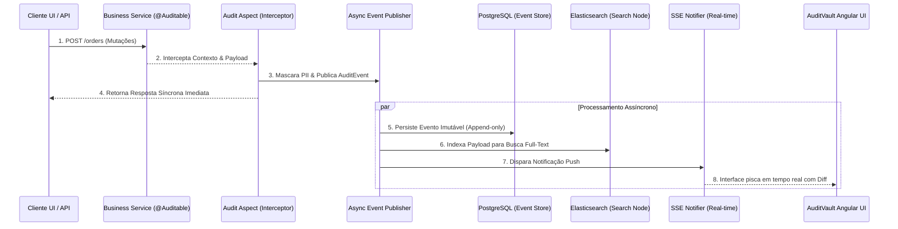

<div align="center">

# 🛡️ AuditVault

**Event-Sourced Auditing Engine & Real-Time Intelligence**

[](https://spring.io/projects/spring-boot)
[](https://angular.io/)
[](https://www.elastic.co/)
[](https://www.postgresql.org/)

*AuditVault responde à pergunta definitiva de negócios: "Quem alterou este registro, quando, e qual era o estado exato antes da mudança?"*

</div>

---

## 🎯 O Problema que Resolvemos

Em sistemas corporativos monolíticos ou microsserviços tradicionais (CRUD), o estado dos dados é constantemente sobrescrito (`UPDATE` / `DELETE`). Quando ocorrem anomalias de faturamento, vazamentos de acesso ou problemas legais, a pergunta surge: **Como esse dado estava no dia 14 às 10h da manhã?**

O **AuditVault** resolve isso acoplando transparentemente a qualquer API via Aspect-Oriented Programming (AOP), interceptando mutações e publicando-as em um modelo **Event Sourcing** indestrutível.

## 🏗️ Arquitetura e Fluxo (Mermaid)



## 🛠️ Tecnologias e Padrões Aplicados

- **Backend**: Java 17, Spring Boot 3.2, Spring AOP, Spring Batch (Relatórios PDF assíncronos), Spring Data JPA, Spring Data Elasticsearch.
- **Frontend**: Angular 17+ (Standalone Components, Signals), TailwindCSS, TypeScript.
- **Infraestrutura**: Docker Multi-stage, Docker Compose, PostgreSQL (JSONB), Elasticsearch 8.x.
- **Padrões Arquiteturais**: Clean Architecture, CQRS (Eventos vs Reconstrução de Estado), Event Sourcing, Outbox-like Publishing, Observabilidade (SRE) com Actuator/Prometheus.

## 🚀 Como Rodar (Developer Experience)

O projeto é 100% conteinerizado. Sem necessidade de instalar dependências locais complexas na sua máquina base.

1. **Clone o repositório**
2. **Suba todo o ecossistema com um único comando**:
   ```bash
   docker-compose up -d --build
   ```

### 🗺️ Mapeamento de Portas

Após o build (que pode levar alguns minutos na primeira execução), acesse os serviços:

| Serviço | URL | Descrição |
|---------|-----|-----------|
| **AuditVault UI** | [http://localhost:4200](http://localhost:4200) | Dashboard Angular em tempo real |
| **Backend API** | `http://localhost:8080/api/audit` | REST API (CQRS e SSE) |
| **Elasticsearch** | `http://localhost:9200` | Motor de busca Full-Text |
| **Métricas SRE** | `http://localhost:8080/actuator/prometheus` | Scrape endpoint para Grafana |

## 💡 Recursos de Destaque

- **Full-Text Search Global**: Ache um evento perdido em milhares buscando qualquer valor inserido nas chaves do JSON de Payload.
- **Snapshots**: Economia extrema de CPU. Estados consolidados reconstruídos não realizam *replay* desde a estaca zero, e sim a partir do último checkpoint (a cada N eventos).
- **Relatórios Async (Spring Batch)**: Geração de PDF em Chunk-Processing não retém conexões HTTP ativas evitando timeouts terríveis para PDFs longos.
- **Data Masking (LGPD/GDPR)**: PII (Personal Identifiable Information) detectada no payload é ofuscada dinamicamente (`***`) por segurança antes da persistência.
