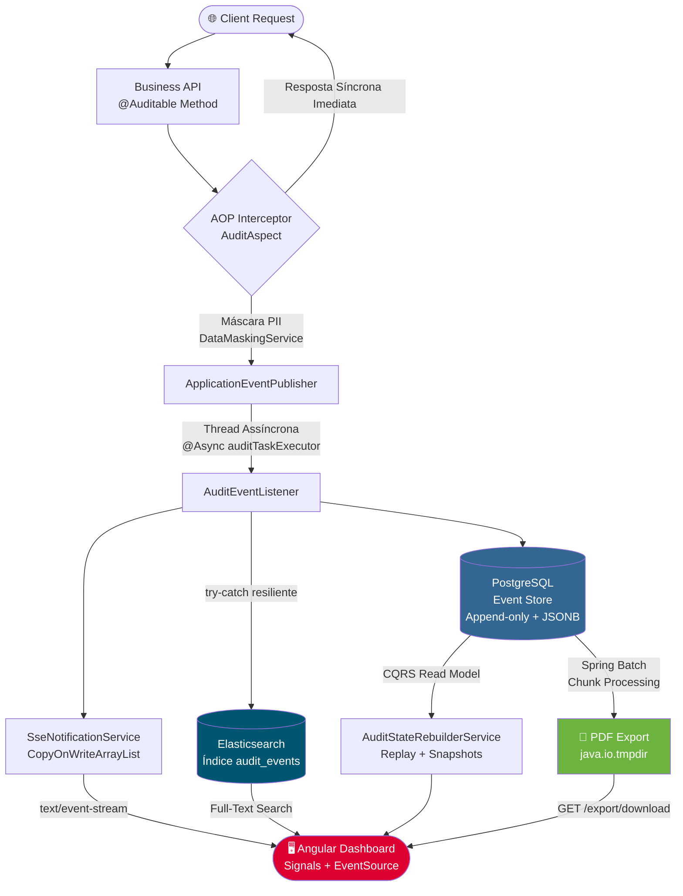

<div align="center">

# 🛡️ AuditVault

[](https://openjdk.org/projects/jdk/17/)
[](https://spring.io/projects/spring-boot)
[](https://angular.io/)
[](https://www.postgresql.org/)
[](https://www.elastic.co/)
[](./LICENSE)

</div>

---

> **"O que aconteceu com o registro X?"** — Toda empresa lida com essa pergunta.

Em sistemas tradicionais baseados em CRUD, mutações sobrescrevem dados irreversivelmente. Quando ocorrem falhas de faturamento, brechas de acesso ou auditorias regulatórias (LGPD, SOX), a investigação chega tarde demais. O **AuditVault** resolve isso de forma elegante: ao anotar um método de serviço com `@Auditable`, todo evento de mutação é interceptado via AOP, mascarado de PII e gravado de forma imutável em um Event Store — nunca mais sobrescrito, sempre reconstituível.

Com CQRS, você consulta o estado exato de qualquer agregado em qualquer ponto no tempo. Com SSE, o dashboard de auditoria reflete eventos *ao vivo*, sem polling. Com Elasticsearch, você encontra qualquer payload específico em milissegundos, mesmo entre milhões de registros.

---

## 🏗️ Arquitetura e Fluxo de Dados



---

## ⚙️ Destaques de Engenharia

- **🔒 Data Masking Automático (LGPD/GDPR):** O `DataMaskingService` detecta chaves sensíveis (`password`, `cpf`, `cardNumber`, `secret`) no payload JSON e as substitui por `***` antes de qualquer persistência — sem esforço manual do desenvolvedor.

- **📸 Snapshots para Reconstrução $O(1)$:** Sem snapshots, reconstruir o estado de um agregado após 10.000 eventos exigiria replay completo. O `SnapshotTriggerService` grava checkpoints a cada N eventos, reduzindo o custo de replay ao mínimo.

- **📄 Exportação PDF Assíncrona (Spring Batch):** Relatórios de auditoria para grandes volumes são gerados em Chunk-Processing sem ocupar uma thread HTTP. O cliente recebe um `jobExecutionId` e busca o PDF pronto via `GET /api/audit/export/download/{id}`.

- **🔍 Full-Text Search (Elasticsearch):** Toda query SQL com `LIKE %termo%` em JSONB degrada linearmente. No AuditVault, o `AuditEventListener` indexa cada evento assincronamente no ES. Pesquisas retornam em milissegundos independente do volume.

- **⚡ Real-Time via SSE:** Server-Sent Events (unidirecional, HTTP puro) foi escolhido sobre WebSockets porque logs de auditoria são inerentemente servidor→cliente. Proxies e load balancers corporativos os atravessam sem configuração extra. O `SseNotificationService` envia heartbeats a cada 25s para evitar drops de conexão ociosa.

- **📊 Observabilidade SRE:** Métricas JVM, pool JDBC, Elasticsearch e latência de endpoints são expostas no formato Prometheus via `/actuator/prometheus`, prontas para dashboards Grafana.

---

## 🛠️ Stack Completa

| Camada | Tecnologia |
|--------|-----------|
| **Backend** | Java 17, Spring Boot 3.2, Spring AOP, Spring Data JPA, Spring Data Elasticsearch, Spring Batch |
| **Banco Write** | PostgreSQL 15 (JSONB para payloads, Flyway para migrações) |
| **Banco Search** | Elasticsearch 8.x |
| **Frontend** | Angular 17+ (Standalone Components, Signals, `@for`/`@if`), TailwindCSS |
| **Relatórios** | Apache PDFBox via OpenPDF + Spring Batch (Chunk-oriented) |
| **Observabilidade** | Spring Boot Actuator + Micrometer (Prometheus) |
| **Infra / DX** | Docker Multi-stage Build, Docker Compose, Nginx (Reverse Proxy + SPA fallback) |
| **Testes** | JUnit 5, Testcontainers (PostgreSQL + Elasticsearch), @WebMvcTest, Spring Batch Integration Tests |
| **Padrões** | Clean Architecture, CQRS, Event Sourcing, AOP, TDD |

---

## 🚀 Como Executar

> **Pré-requisito único:** [Docker Desktop](https://www.docker.com/products/docker-desktop/) instalado e em execução.

```bash
# 1. Clone o repositório
git clone https://github.com/joaogabriel43/AuditVault.git
cd AuditVault

# 2. Suba toda a infraestrutura com um único comando
docker-compose up -d --build
```

O Docker Compose irá construir as imagens e levantar, na ordem correta:
1. 🐘 `auditvault-postgres` — Event Store (aguarda healthcheck)
2. 🔍 `auditvault-elasticsearch` — Motor de busca full-text (aguarda healthcheck)
3. ☕ `auditvault-backend` — API Spring Boot (aguarda Postgres + ES estarem saudáveis)
4. 🌐 `auditvault-frontend` — Dashboard Angular servido pelo Nginx

### 🗺️ Serviços Disponíveis

| Serviço | URL | Descrição |
|---------|-----|-----------|
| **Dashboard UI** | [http://localhost:4200](http://localhost:4200) | Angular + Tailwind com SSE ao vivo |
| **REST API** | `http://localhost:8080/api/audit` | Endpoints CQRS, Search e Export |
| **Health Check** | [http://localhost:8080/actuator/health](http://localhost:8080/actuator/health) | Status de todos os componentes |
| **Métricas SRE** | [http://localhost:8080/actuator/prometheus](http://localhost:8080/actuator/prometheus) | Scrape para Grafana/Prometheus |
| **Elasticsearch** | [http://localhost:9200](http://localhost:9200) | Motor de busca (direto) |

---

## 📡 Endpoints Principais da API

```http
# Buscar eventos paginados de um agregado
GET /api/audit/events/{aggregateId}?page=0&size=20

# Reconstruir estado de um agregado em um ponto no tempo (CQRS)
GET /api/audit/state/{aggregateId}?targetTime=2024-01-15T10:30:00Z

# Full-Text Search em todos os payloads (Elasticsearch)
GET /api/audit/search?query=laptopPro&page=0&size=10

# Disparar exportação PDF assíncrona (Spring Batch)
POST /api/audit/export/{aggregateId}
→ { "jobExecutionId": 42, "status": "STARTED" }

# Baixar PDF gerado
GET /api/audit/export/download/42

# Stream de eventos em tempo real (SSE)
GET /api/audit/stream   →  text/event-stream
```

---

<div align="center">

**Construído com ❤️ sobre os pilares de Clean Architecture, TDD e Event Sourcing**

</div>
